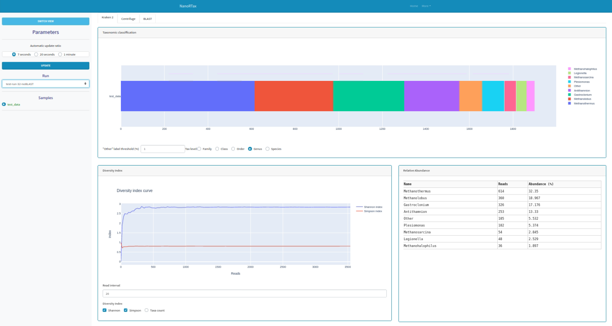
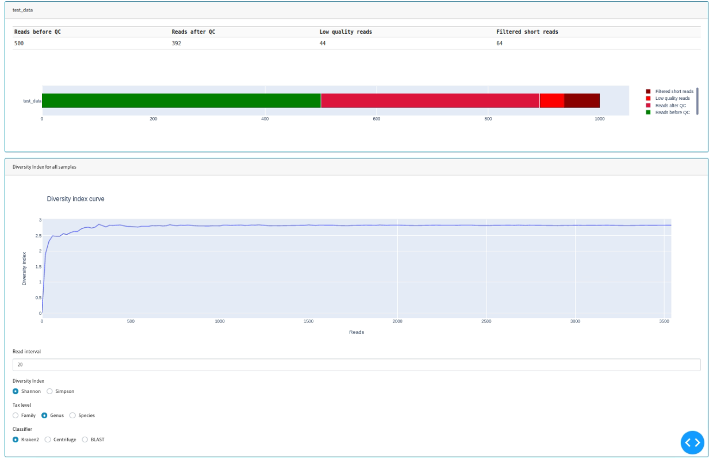
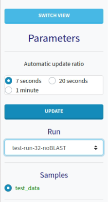
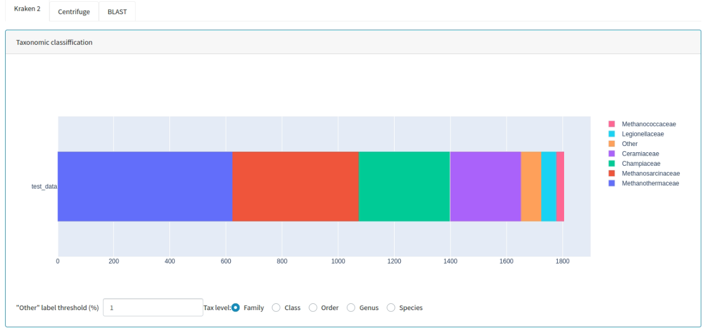
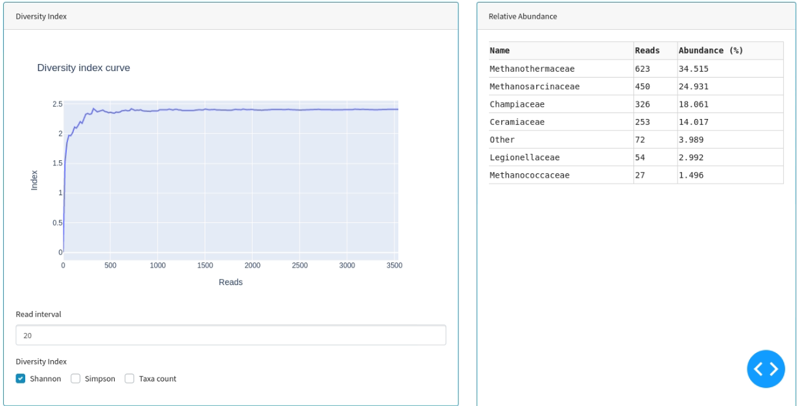

# Dash Web Application

Along with the text reports, NanoRTax output files are also consumed by the web application, providing an interactive visualization mode for results inspection.

The webapp is independent of the NanoRTax main pipeline. It can be executed at any time to consult past results or while the pipeline in running to inspect results as soon as they are processed.

## Quick Start

Get the conda environment for the webapp and start the server:
```bash
cd viz_webapp && python dashboard.py
```
Access the interface with a web browser (http://127.0.0.1:8050/ by default):

## App overview and screenshots

This is the dashboard general view. It will show the information regarding a sample from the last NanoRTax execution:



Users can switch the view in the sidebar to show general information about the samples in the current NanoRTax run. This view includes QC reports and a multi-sample diversity plot with parameters selection:



The sidebar allows to switch between the two views showed above, change the auto-update ratio and selection of NanoRTax run and sample within that run:



On sample view, it is possible to select the taxonomic level for all the results and the "other" label threshold (%):



This view also shows a relative abundance table and a diversity index plot for the sample at the selected taxonomic level above. The diversity plot shows the change in different diversity indexes with read count and allows plotting of Shannon and Simpson diversity indexes and taxa count:

